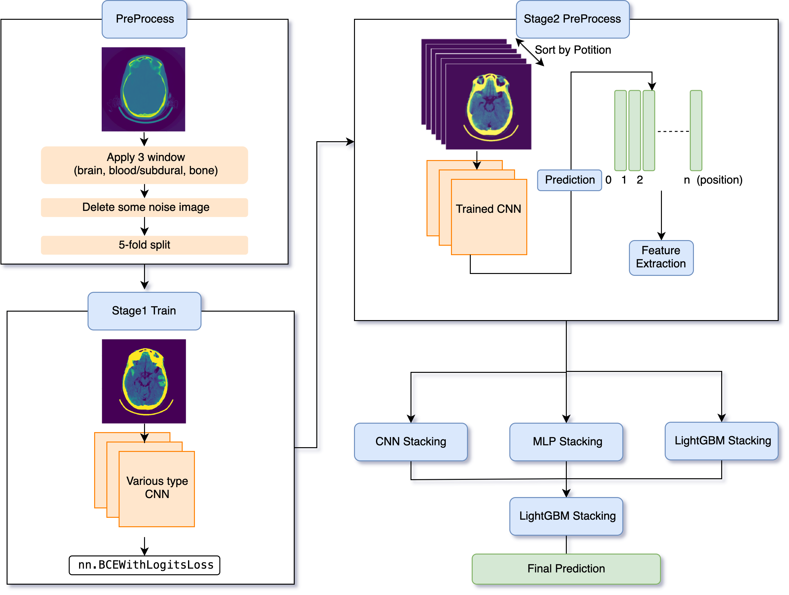

# kaggle-rsna-intracranial-hemorrhage-detection 10th place solution

- This is the project for RSNA Intracranial Hemorrhage Detection hosted on Kaggle in 2019.
- We mostly used @appian code (https://github.com/appian42/kaggle-rsna-intracranial-hemorrhage). Thank you very much appian !

## Pipeline



## Data download

Plese download data to `./input` from https://www.kaggle.com/c/rsna-intracranial-hemorrhage-detection.

## Hardware
We used GCP with following specs to train this model.
```
OS: Ubuntu
GPU: NVIDIA Tesla P100/V100
```

## Usage

```
# prepare docker image
sh bin/build_image.sh

# 5-fold aplit / delete some noise / metadata extraction from dicom
sh bin/preprocess.sh

# If you want to run all train and predict scripts (take a long time)
sh bin/run.sh

# If you want to train specific model
cd models/base_cnn/[model_name]/
sh bin/train.sh
```


## Directory tree
```

│
│- input
│  │- stage_2_sample_submission.csv : test csv (label columns are filled with 0.5)
│  │- stage_2_train.csv : train csv
│  │
│  │- stage_2_train_images
│  │  │_*.dcm : train dicoms
│  │
│  │- stage_2_test_images
│     │-*.dcm : test dicoms
│
│
│- output
│  │- submission.csv : predicted test csv
│
│
│- bin : main file
|  |- build_image.sh
│  │- preprocess.sh
│  │- run.sh
│
│
│- models
│  │- base_cnn : base CNN models
│  │  │- model_base : appian's base model
│  │  │- ricky_se_resnext_410 : change img_size of backbone to 410 
│  │  │- ricky_se_resnext101_mixup : change backbone of model_base to se_resnext101 and use mixup
│  │  │- ricky_senet154_customlabels : custom labels model
│  │  │- shimacos_models : using adjacent image / label_smoothing / without any prediction 
│  │  │- sugawara_efficientnetb3 : change backbone of model_base to efficientnetb3
│  │  │- 2kyym_inception_resnet_v2 : change backbone of model_base to InceptionResnetV2
│  │  │- 2kyym_inceptionv4 : change backbone of model_base to InceptionV4
│  │  │- 2kyym_xception : change backbone of model_base to Xception
│  │
│  │- first_stacking : first level stacking models
│  │  │- cnn_stacking_1.py (ricky)
│  │  │- cnn_stacking_2.py (shimacos)
│  │  │- lgbm_first_stacking.py (sugawarya)
│  │  │- mlp_stacking.py (sugawarya)
│  │
│  │- second_stacing : second level stacking models
│     │- lgbm_second_stacking.py (sugawarya)
│
│
│- intermediate_output : preprocessed files and intermediate outputs
   │- preprocessed_data
   │  │- train.pkl : preprocessed train file (appian's base model)
   │  │- train_raw.pkl : preprocessed train file (appian's base model)
   │  │- train_folds.pkl : splitted train file (appian's base model)
   │  │- test.pkl : preprocessed train file (appian's base model)
   │  │- test_raw.pkl : preprocessed test file (appian's base model)
   │  │
   │  │- train_senet154_customlabels.pkl : preprocessed train file (ricky's senet154_customlabels)
   │  │- train_raw_senet154_customlabels.pkl : preprocessed train file (ricky's senet154_customlabels)
   │  │- train_folds_senet154_customlabels.pkl : splitted train file (ricky's senet154_customlabels)
   │  │- test_senet154_customlabels.pkl : preprocessed train file (ricky's senet154_customlabels)
   │  │- test_raw_senet154_customlabels.pkl : preprocessed test file (ricky's senet154_customlabels)
   │  │- other preprocessed files
   │
   │- model_base
   │  │- fold{0-4}_test.pkl
   │  │- fold{0-4}_valid.pkl
   │  │- weight files
   │  │- log files
   │  │- tmp files
   │
   │- ricky_se_resnext_410
   │  │- fold{0-4}_test.pkl
   │  │- fold{0-4}_valid.pkl
   │  │- weight files
   │  │- log files
   │  │- tmp files
   │
   │- ricky_se_resnext101_mixup
   │  │- ...
   │
   │- ...
   │
   │- cnn_stacking_1
   │  │- fold{0-4}_test.pkl
   │  │- fold{0-4}_valid.pkl
   │  │- weight files
   │  │- tmp files
   │
   │- cnn_stacking_2
   │  │- ...
   │
   │- ...
   │
   │- stacking2nd_lgbm
      │- pred_test.pkl
      │- pred_valid.pkl
```
